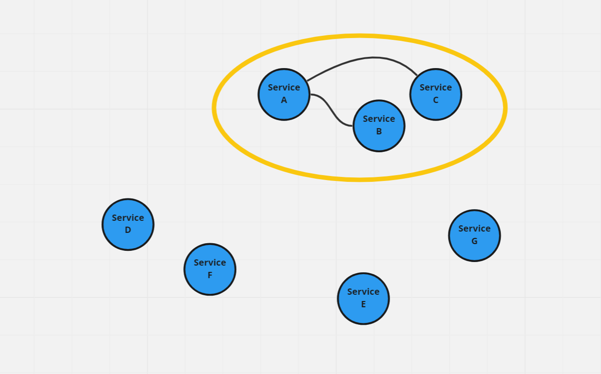
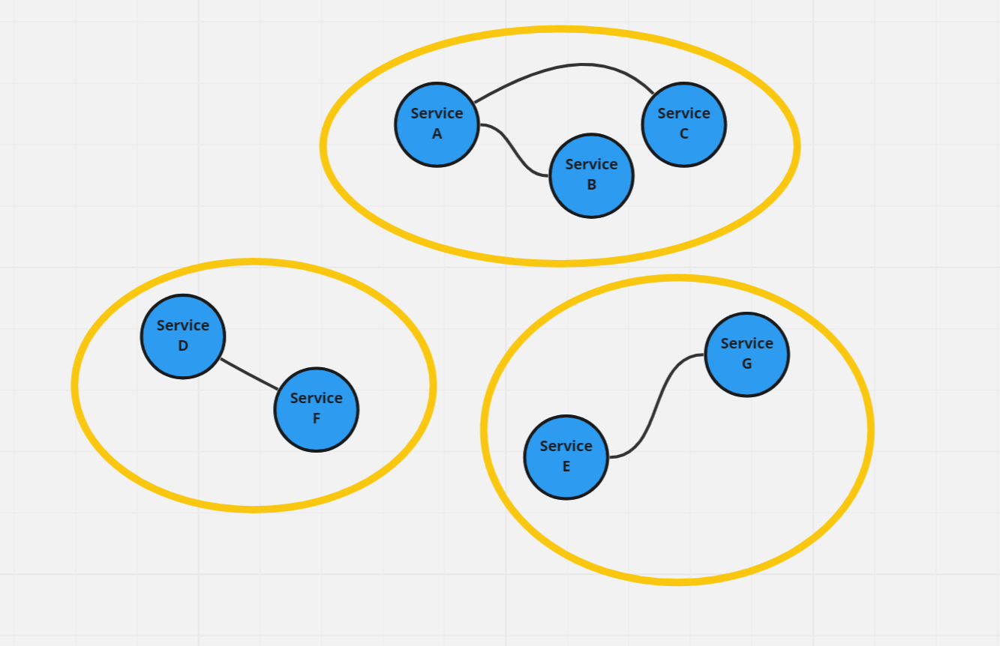
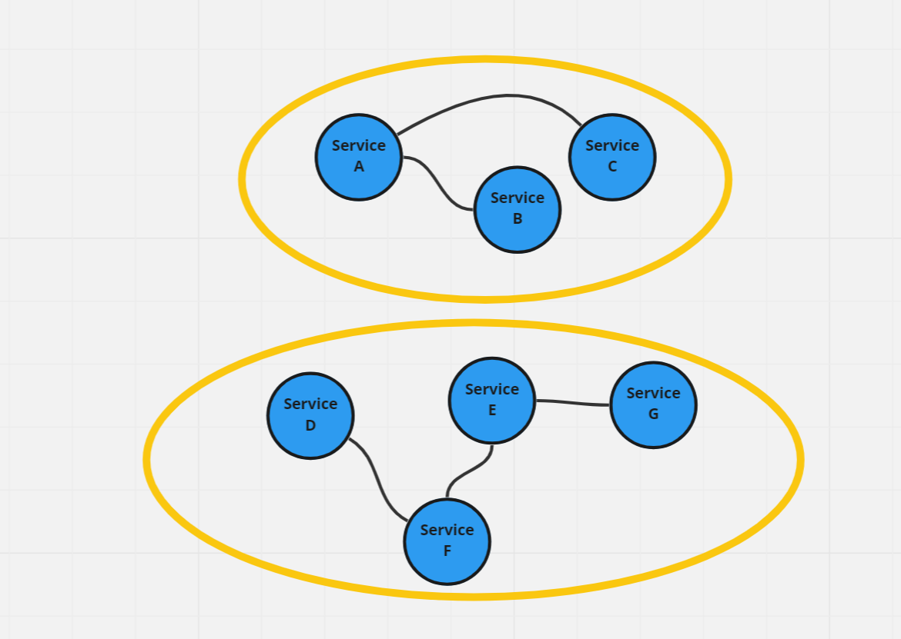

<div align="center">
  <h1><ins>Software Architecture Calculator
</ins></h1>
</div>
## 🚀 Run 

### Neo4j DB

```bash
docker run \
    --name calculator-neo4j \
    -p7474:7474 -p7687:7687 \
    -d \
    -v $HOME/neo4j/data:/data \
    -v $HOME/neo4j/logs:/logs \
    -v $HOME/neo4j/import:/var/lib/neo4j/import \
    -v $HOME/neo4j/plugins:/plugins \
    --env NEO4J_AUTH=neo4j/test \
    --env NEO4J_PLUGINS='["graph-data-science"]' \
    neo4j:latest
```

DB-Browser can be accessed via http://localhost:7474/browser/.

### Application

```bash
./gradlew bootRun
```

Results are written to `./build/resources/main/`.

## ✨ Approach

1. Cluster services into sub-system via `Leiden` algorithm
2. If optimal cluster size exceeds threshold:
   * Connect clusters with the least number of services (randomly) together
   * Repeat from 1.

### Visualization for Step 2.








## Acknowledges

* https://neo4j.com/developer/docker-run-neo4j/
* https://neo4j.com/developer/java/
* https://neo4j.com/docs/graph-data-science/current/algorithms/community/
* https://neo4j.com/docs/graph-data-science/2.2/algorithms/alpha/leiden/

## Common Changes

### Get Nodes

```
MATCH (s:Service)-[:COMMON_CHANGES]-(other)
RETURN s, other
LIMIT 180
```

Omit Certain Clusters

```
MATCH (s:Service)
WHERE s.commonChangesClusterId != 51
RETURN s
LIMIT 250
```

### Get Specific Node

```
MATCH (s:Service)
WHERE s.name ="Renew_ZOHOZ"
RETURN s
```

### Get Nodes in Specic Clusters

```
MATCH (s:Service)
WHERE s.commonChangesClusterId = 51
RETURN s
```

### Get Cluster Sizes

```
MATCH (s:Service)
WITH s.commonChangesClusterId as changesClusterId, count(s) as count
RETURN changesClusterId, count
ORDER BY count desc
```

## Performance

### Get Nodes

```
MATCH (s:Service)-[:CALLS]-(other)
RETURN s, other
```

### Get Specific Node

```
MATCH (s:Service)-[:CALLS]-(other)
WHERE s.name ="Delete_CAFOR"
RETURN s, other
```

### Get Nodes in Specic Clusters

```
MATCH (s:Service)
WHERE s.performanceId = 3
RETURN s
```

### Get Cluster Sizes

```
MATCH (s:Service)
WITH s.performanceId as performanceId, count(s) as count
RETURN performanceId, count
ORDER BY count desc
```


---

## Random Notes

```
CREATE
  (nAlice:User {name: 'Alice', seed: 42}),
  (nBridget:User {name: 'Bridget', seed: 42}),
  (nCharles:User {name: 'Charles', seed: 42}),
  (nDoug:User {name: 'Doug'}),
  (nMark:User {name: 'Mark'}),
  (nMichael:User {name: 'Michael'}),

  (nAlice)-[:LINK {weight: 1}]->(nBridget),
  (nAlice)-[:LINK {weight: 1}]->(nCharles),
  (nCharles)-[:LINK {weight: 1}]->(nBridget),

  (nAlice)-[:LINK {weight: 5}]->(nDoug),

  (nMark)-[:LINK {weight: 1}]->(nDoug),
  (nMark)-[:LINK {weight: 1}]->(nMichael),
  (nMichael)-[:LINK {weight: 1}]->(nMark);
```


```
CALL gds.graph.drop('myGraph') YIELD graphName;
CALL gds.graph.project(
    'myGraph',
    'User',
    {
        LINK: {
            orientation: 'UNDIRECTED'
        }
    },
    {
        nodeProperties: 'seed',
        relationshipProperties: 'weight'
    }
)
```


```
CALL gds.alpha.leiden.stream('myGraph', { randomSeed: 19 })
YIELD nodeId, communityId
RETURN gds.util.asNode(nodeId).name AS name, communityId
ORDER BY name ASC
```


---

```
match (s:Service) return count(s)
```

```
match (s:Service) delete s
```


```
match (s:Service {name: 'Reject_TUVOG'}) -- (o:Service)
return s, o
```

```
match (s:Service)-[:COMMON_CHANGES]-(OtherNodes)
return s, OtherNodes
```


```
CALL gds.graph.drop('commonChangesGraph', false) YIELD graphName;
CALL gds.graph.project(
    'commonChangesGraph',
    'Service',
    {
        COMMON_CHANGES: {
            orientation: 'UNDIRECTED'
        }
    },
    {
        relationshipProperties: 'weight'
    }
)
```


```
CALL gds.alpha.leiden.stream('commonChangesGraph', { 
	randomSeed: 19, 
	relationshipWeightProperty: 'weight' 
})
YIELD nodeId, communityId
RETURN gds.util.asNode(nodeId).name AS name, communityId
ORDER BY name ASC
```

```
CALL gds.alpha.leiden.stats('commonChangesGraph', { 
	randomSeed: 19,
	maxLevels: 20,
	relationshipWeightProperty: 'weight'
})
YIELD communityCount
```


```
CALL gds.louvain.stream('commonChangesGraph', { relationshipWeightProperty: 'weight' })
YIELD nodeId, communityId, intermediateCommunityIds
RETURN gds.util.asNode(nodeId).name AS name, communityId, intermediateCommunityIds
ORDER BY name ASC
```

```
CALL gds.louvain.stats('commonChangesGraph', { relationshipWeightProperty: 'weight' })
YIELD communityCount
```


```
CALL gds.labelPropagation.stream('commonChangesGraph', { relationshipWeightProperty: 'weight' })
YIELD nodeId, communityId AS Community
RETURN gds.util.asNode(nodeId).name AS Name, Community
ORDER BY Community, Name
```

```
CALL gds.labelPropagation.stats('commonChangesGraph', { relationshipWeightProperty: 'weight' })
YIELD communityCount
```


---


```
CALL gds.graph.drop('commonChangesGraph', false) YIELD graphName;
CALL gds.graph.project(
    'commonChangesGraph',
    'Service',
    {
        COMMON_CHANGES: {
            orientation: 'UNDIRECTED'
        }
    },
    {
        relationshipProperties: 'weight'
    }
)
```


```
CALL gds.alpha.leiden.write('commonChangesGraph', { 
	writeProperty: 'communityId',
	relationshipWeightProperty: 'weight'
})
YIELD communityCount, nodePropertiesWritten
```


```
match (s:Service)
with s.commonChangeClusterId as id, count(s) as count
return id, min(count)
```

```
match (s:Service)-[r]-(other) 
where s.commonChangeClusterId = 266
return s, other
```

```
match (s:Service)
where s.commonChangeClusterId = 4
return s
```

```
match (s:Service)
with s.commonChangeClusterId as id, count(s) as count 
where count = 1
return id, count
```

```
match (s:Service)
with s.commonChangeClusterId as id, count(s) as count 
where count = 1
return id, count
```


Min

```
match (s:Service)
with s.commonChangeClusterId as id, count(s) as count 
return min(count) as min
```

All Groups

```
match (s:Service)
with s.commonChangeClusterId as id, count(s) as count 
return min(count) as min
```

All Nodes

```
CALL {
	match (s:Service)
    with s.commonChangeClusterId as id, count(s) as count
    where count = 1
    return id
}
with id
match (s:Service)
where s.commonChangeClusterId in id
return s as nodes

```


---

```
match (s:Service)
with s.commonChangeClusterId as id, count(s) as count
return id, min(count)
```


```
match (s:Service)-[r]-(other)
where s.name = 'Assign_RAVEZ'
return s, other
```


```
CALL gds.wcc.stats('commonChangesGraph', {
	relationshipWeightProperty: 'weight',
  	threshold: 0.0
})
YIELD componentCount
```


possible smallest cluster algorithm...

```
CALL {
	match (s:Service)
	with s.performanceId as id, count(s) as count
	return min(count) as min1
}
with min1
call {
	match (s:Service)
	with s.performanceId as id, count(s) as count
	where count > min1
	return min(count) as min2
}
with min2
call {
	match (s:Service)
	with s.performanceId as id, count(s) as count
	where count > min2
	return min(count) as min3
}
with min3
match (s:Service)
with s.performanceId as id, count(s) as count
where count > min3
return min(count) as min


```


```
CALL {
    MATCH (s:Service)
    WITH s.${cfg.cluster} as id, count(s) as count
    where count <= $count
    return id
}
WITH id
MATCH (s:Service)
WHERE s.${cfg.cluster} in id
RETURN count(s) as nodeCount
```


---

